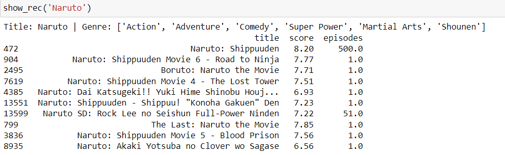
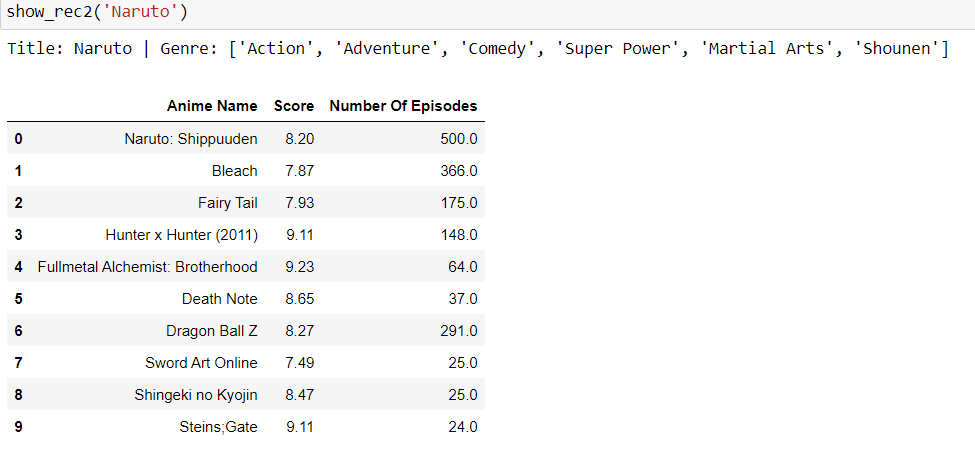
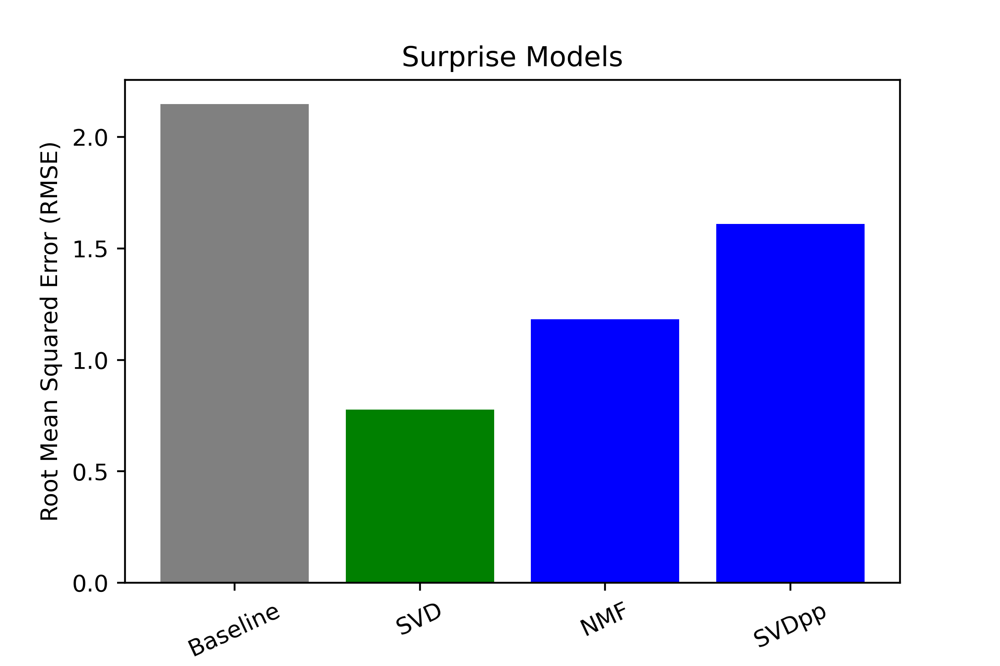

# Anime-Recommendation-Systems
<p align="center">
    
</p>

**Author**: Clara Giurgiu


## Overview

This project aims to build an anime recommendation system for new members and current subscribers of an anime streaming service. New members can use a content-based approach to receive recommendations based on a show they may have watched or heard of previosuly. For current subscribers, collaborative filtering is used by comparing the users' ratings and returning shows similar users have rated similarly. 

## Business Understanding

The anime industry is growing rapidly, with new shows being released all the time. This can make it difficult for anime fans to find new shows to watch that they will enjoy. Other general content streaming services such as Netflix, which has one of the best recommendation systems, has a substantial anime database as well as coming up with their very own productions. To keep up, anime streaming services should strive to use the technology available to keep improving their recommendations and in turn retain their viewers and market to new ones.

This project aims to build a recommendation system that will help anime fans discover new shows that they will enjoy. The recommendation system will provide a curated list of shows to users based on their content preferences and similar user's picks. The system will use a variety of factors to make its recommendations, including:

- The user's past viewing history
- The user's ratings of other shows
- The ratings of other users who have similar viewing habits
- The genre of the show
- Number of episodes the show has

The recommendation system will help anime fans save time by discovering new genres of anime and finding shows that are similar to their favorites. Anime fans will no longer have to spend hours searching for new shows to watch, as the recommendation system will suggest shows based on their past viewing history and the ratings of other users who have similar viewing habits. The system will also help anime fans discover new genres of anime that they may not have considered watching before. Additionally, the recommendation system will help anime fans find shows that are similar to their favorites, by suggesting other shows that are similar in tone, style, or genre.


## Data Understanding

I used data scraped from MyAnimeList.net, which includes several features of the anime show, as well as user ratings. The data is available for download from [Kaggle.com](https://www.kaggle.com/datasets/CooperUnion/anime-recommendations-database/versions/1?resource=download). The main dataset is a CSV file containing a list of 19, 311 shows with features such as title, synopsys, genre, and number of episodes. The second dataset has 7,813,737 rows of users rating different anime shows. The cleaned version of the dataset is compressed in a zip folder. All datasets can be found in the Data folder [here](https://github.com/claragiurgiu/Anime-Recommendations/tree/main/Data).

## Data Preparation

The datasets used for this project were sourced from Kaggle. The datasets were in a good state and did not require a significant amount of cleaning before modeling.

The following steps were taken to clean and prepare the data:

Duplicates: I removed duplicates in the Animes.csv dataset. 

Null values: There were a few nulls in the Animes.csv dataset in the *synopsis*, *episodes*, *ranked*,  and *score* columns. I dropped the nulls in synopsis and episodes and I replaced ranked and score with the mean values in those columns

Column names: Column names were formatted for visualization purposes.

Removing missing rating: The Rating.csv dataset had 1,476,496 shows that were missing a rating and removed for modeling purposes. The final dataset contained 6,337,241 entries. 

## Methods and Models

For the recommendation systems in this project, I used a content-based approach and a collaborative filtering approach. 
One of the drawbacks of recommendation engines is the cold-start issue for new users. To overcome this, I built two content-based systems. One uses the description of a show to return shows with similar descriptions and the second option uses other features of the show such as genre, number of episodes and score to return similar shows. 

**Content Based - Synopsis**



**Content Based - Similarities**



The choice of model based on content will depend on what the user is more interested in. Option one can be used if the user wants to watch more of the same show they enjoyed, such as sequels if there are any, or movies that fill the gaps between seasons. 
If the user is looking for something new, but in the same vein as a comfort show such as Naruto, option 2 will recommend different shows that share some of the themes and elements in the show but with new characters and stories. 

**Collaborative Filtering**

For collaborative filtering, I established a baseline using a normal predictor that predicts a random rating based on the distribution of the dataset. I then iterated through several Singular Value Decomposition (SVD) models, from which the final model was chosen. 
Singular value decomposition (SVD) is a matrix factorization technique that decomposes a matrix into two matrices of non-negative values. The first matrix, called the basis matrix, represents the underlying factors that explain the data. The second matrix, called the coefficient matrix, represents the weights of each factor in each data point.

SVD can be used to generate latent features by decomposing the sparse user-item interaction matrix into two smaller and dense matrices of user and item entities. The basis matrix represents the latent features of the users, while the coefficient matrix represents the weights of each latent feature for each item.

The latent features can then be used to make predictions. For example, if a user has not rated an item, the model can use the latent features of the user and the item to predict how the user would rate the item.
I also tried a non-negative matrix factorization (NMF) model, but it was not very successful. NMF is another dimensionality reduction technique that decomposes a matrix into two matrices of non-negative values. However, NMF is not as effective as SVD for collaborative filtering.

Finally, I tried a Singular Value Decomposition plus plus (SVD++) model. SVD++ is an extended version of SVD that works mostly on users' implicit and explicit ratings for the item. SVD++ was more successful than NMF, but it was not as successful as SVD.

The final model was chosen based on its accuracy and performance with a RMSE of 0.9571 compared to the baseline of 2.1488.

In conclusion, the SVD model was the most successful model for collaborative filtering. The model was able to generate latent features and make accurate predictions for a wide range of users and items.




### Conclusions

In conclusion, the collaborative filtering recommendation system is able to predict estimated ratings with an error of 1.5 and return recommendations that a user will most likely rate highly based on their previous rating patterns and similar users' ratings of the recommendations.
Overall, collaborative filtering is a powerful technique that can be used to recommend anime to users. However, it is important to be aware of the limitations of the approach and to use it in conjunction with other techniques, such as content-based filtering, to provide the best possible recommendations.
Some of the limitations of collaborative filtering:
 - Data sparsity: Collaborative filtering algorithms rely on users having rated a large number of items. However, in practice, many users only rate a small number of items. This can lead to inaccurate recommendations.
    -  One way to overcome data sparsity is to use content-based filtering in conjunction with collaborative filtering. Content-based filtering algorithms recommend items to users based on the content of the items that the user has rated. This can help to fill in the gaps in the data that is available for collaborative filtering.
 - Cold start: Collaborative filtering algorithms cannot recommend items to users who have not yet rated any items. This can be a problem for new users or users who have recently changed their interests.
    -  A potential solution to the cold start problem is to use a hybrid approach that combines collaborative filtering with content-based filtering. In this approach, the algorithm first uses content-based filtering to recommend items to the new user. The algorithm then uses collaborative filtering to refine the recommendations by taking into account the ratings of other users.
 - Bias: Collaborative filtering algorithms can be biased by the ratings of other users. For example, if a user only rates popular items, the algorithm will recommend other popular items to that user, even if the user might prefer less popular items.
    - One way to overcome bias is to use a variety of collaborative filtering algorithms and to combine their results. This can help to reduce the impact of any individual algorithm's biases.

## Next Steps
* Scrape more recent data
* Improve the algorithms by trying new search parameters
* Hybrid system
* Use differrent modeling algorithms


## Repository Structure
```
├── Data
├── Images
├── .gitignore
├── Collaborative_Filtering.ipynb
├── Content_Based.ipynb
├── EDA_notebookipynb
├── LICENSE
├── README.md
└── Recommendation_System_Presentation.pdf